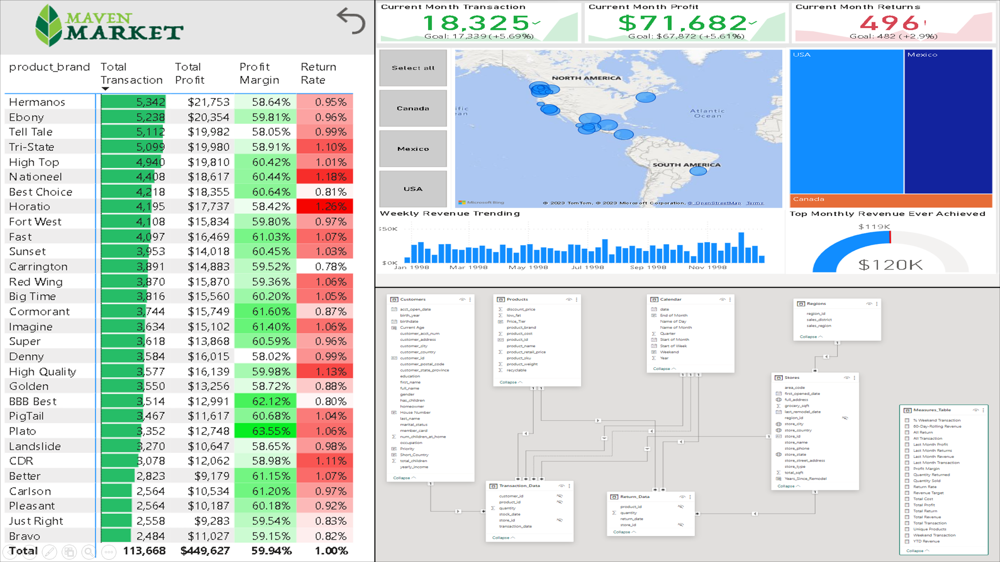

# Data Analysis Portfolios
Portfolio of my data analysis projects for course assignment and personal purposes.

## Maven Adventure Works Project - Analyzing Data of a Global Cycling Manufacturing Company

This Project Case is part of the [Microsoft Power BI Desktop for Business Intelligence Course](https://www.udemy.com/course/microsoft-power-bi-up-running-with-power-bi-desktop/) on [Udemy](https://www.udemy.com) online platform by **Maven Analytics**. In this case, I am being put in the point of view of a Business Intelligence Analyst in **AdventureWorks**, a global manufacturing company that runs cycling equipment and accessories production. The Management Team needs a way to track the KPI, monitor and compare the performance, and identify some insights, as well as high value customers.

[Read more](https://triwgani.github.io/Maven01/)

## Maven Market Project - Analyzing Data of a Grocery Chain Firm

This Project Case is part of the Microsoft Power BI Desktop for Business Intelligence Course on [Udemy](https://www.udemy.com/course/microsoft-power-bi-up-running-with-power-bi-desktop/) online platform by Maven Analytics. In this case, I worked with data from **Maven Market**, a multi-national grocery chain with locations in **Canada, Mexico** and the **United States**.

[Read more](https://triwgani.github.io/Maven02/)

## Tata Virtual Case Experience

This Virtual Experience case is held by Tata. In this virtual experience programme, I am being put in the point of view of a data visualization analyst at Tata iQ, a division of Tata Limited Industries that provides analytics and solutions, to address various stakeholders needs. The expectation is set to understand the stakeholders objectives and translate those into apt and intuitive dashboard or visualizations. The visualization is aimed to bring impact by delivering insights that might be applicable to empower business.

[Read more](https://triwgani.github.io/Tata.DataVisualization/)

## PwC Switzerland Virtual Case Experience

This virtual Experience is held by PwC (PricewaterhouseCoopers) Switzerland. In this virtual experience case, I am given some tasks to simulate a condition in which I work together in a team to help client solve their problems by using technology. Power BI is used in the experience case to clean, wrangle, and visualize data so that client can better understand their customers and employees.

[Read more](https://triwgani.github.io/pwc_digital.transformation/)

## Analyzing Data with Python

In today’s digital era, e-commerce has become a thriving industry, generating vast amounts of data that hold valuable insights for businesses. To unlock the potential of this data and gain a competitive edge, organizations are turning to Python, a powerful programming language with extensive data analysis capabilities.

[Read more](https://triwgani.github.io/ADWP/)

## E-Commerce Company

The analysis performs initial investigation on data and utilizes them to answer business question. It involves the process of analyzing the relations among databases provided. This work is part of the project in MySkill Data Analysis Bootcamp.

[Read more](https://triwgani.github.io/E-Commerce_Company/)

## Sales_Transaction

The analysis explores the transaction data from an E-Commerce firm. The analysis reveals its ability to drive business growth and impact on decision-making processes such as how to determine the sales and marketing strategies. This work is also part of the project in MySkill Data Analysis Bootcamp.

[Read more](https://triwgani.github.io/Sales_Transaction/)

